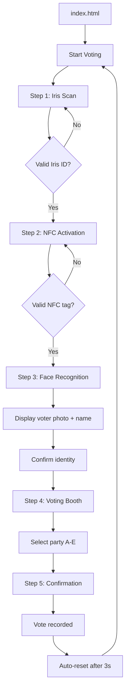

# CryptoBallot

A simulated biometric multi-factor authentication voting system — a front-end demonstration of secure, transparent digital elections.

## Stack

- HTML5 / CSS3 / Vanilla JavaScript (ES6+)
- No frameworks — pure static front-end
- JSON-based voter database

## How it works

CryptoBallot walks a voter through a 5-step authentication and voting wizard:

1. **Iris Scan** — voter enters a pre-registered Iris ID
2. **NFC Activation** — voter enters an NFC tag ID
3. **Face Recognition** — matched voter photo and name are displayed for confirmation
4. **Voting Booth** — voter selects one of five parties
5. **Confirmation** — vote recorded message with session reset

All voter data is loaded from a static `voters.json` file. The entire flow runs client-side with no backend dependency.

## Key features

- 3-factor authentication simulation (biometric, possession, confirmation)
- 5-step wizard with step-by-step navigation
- Dark cyber aesthetic with cyan/teal accent palette
- Double-vote prevention within a session
- Console-logged "blockchain" vote recording simulation

## What this demonstrates

- Building a complete multi-step UI wizard from scratch
- State management in vanilla JavaScript
- Dark-themed UI design with CSS custom properties
- Form validation and user flow design

## Run locally

Open `new/index.html` in any browser. No server required.
